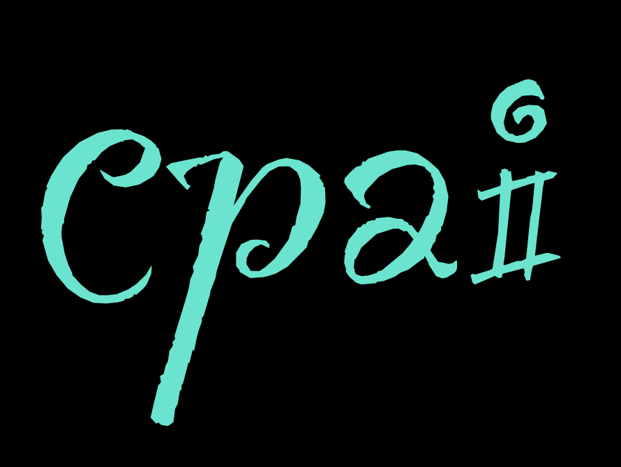

yntax highlighted code block

# Header 1
## Header 2
### Header 3

- Bulleted
- List

1. Numbered
2. List

**Bold** and _Italic_ and `Code` text

<html lang="en-us">
    
<head>
    <meta charset="UTF-8">
    <meta name="description" content="Center for Philosophy of Artificial Intelligence, University of Copenhagen">
    <meta name="keywords" content="CPAI,AI,Philosophy,NLP,LLMs">
    <title>Center for Philosophy of Artificial Intelligence, University of Copenhagen</title>
    <meta name="viewport" content="width=1024">
    <link rel="stylesheet" type="text/css" href="stylesheets/normalize.css" media="screen">
    <link href='https://fonts.googleapis.com/css?family=Open+Sans:400,700' rel='stylesheet' type='text/css'>
    <link rel="stylesheet" type="text/css" href="stylesheets/stylesheet.css" media="screen">
    <link rel="stylesheet" type="text/css" href="stylesheets/github-light.css" media="screen">
    
</head>

<body>
    

        
         
        
         
        
Doing research at the intersection of AI, machine learning, philosophy of mind, and ethics, all sponsored by <a href="https://www.carlsbergfondet.dk/en">CRF</a> and <a href="https://www.aicentre.dk/">Pioneer Centre for AI></a>.

         

        
